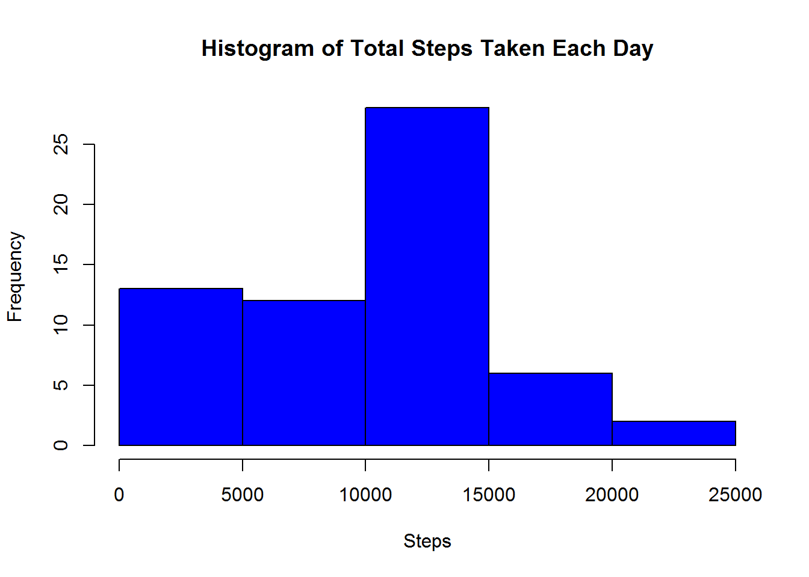
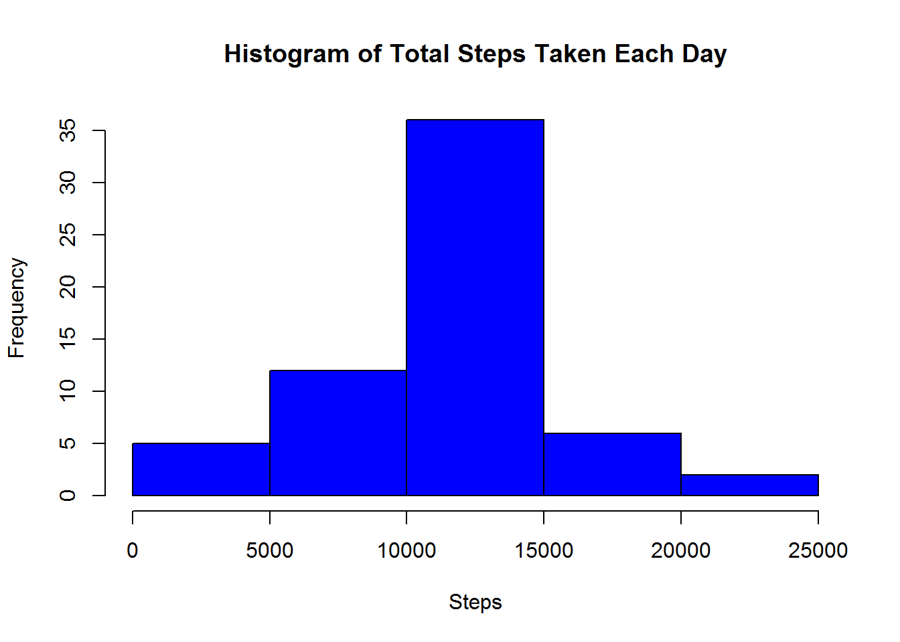
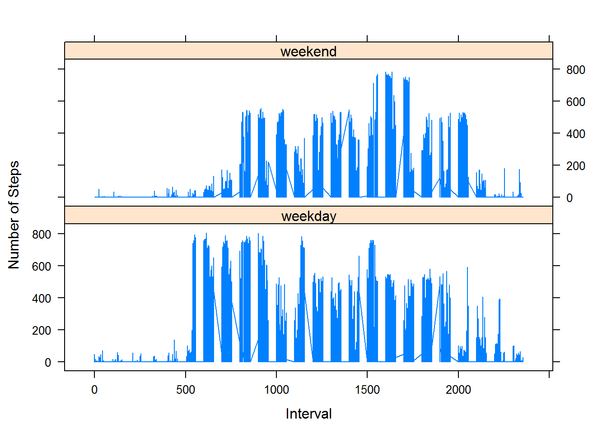

### Load up the data set and needed libraries

    data <- read.csv(unz("activity.zip", "activity.csv"),stringsAsFactors = FALSE)
    library(dplyr)

    ## 
    ## Attaching package: 'dplyr'

    ## The following objects are masked from 'package:stats':
    ## 
    ##     filter, lag

    ## The following objects are masked from 'package:base':
    ## 
    ##     intersect, setdiff, setequal, union

    library(lattice)

### What is mean total number of steps taken per day?

1.  Calculate the total number of steps taken per day

<!-- -->

    #calculate the total number of steps taken per day
    data %>%
      select(-interval) %>%
      group_by(date) %>%
      summarize_each(funs(sum(., na.rm = TRUE))) -> dayTotal

1.  Histogram of the total number of steps taken each day

<!-- -->

    #create histogram of number of steps taken each day
    hist(x = dayTotal$steps, col="blue", main="Histogram of Total Steps Taken Each Day", xlab="Steps")

    #calculate and report the mean and median of the total number of steps taken per day, rounding down to nearest step
    stepMean <- as.integer(mean(dayTotal$steps))
    stepMedian <- as.integer(median(dayTotal$steps))

1.  The mean total number of steps taken per day is 9354, and the median
    is 10395.

### What is the average daily activity pattern?

1.  Time series plot of the 5-minute interval and the average number of
    steps taken, averaged across all days

<!-- -->

    data %>%
      select(-date) %>%
      group_by(interval) %>%
      summarize_each(funs(mean(., na.rm = TRUE))) -> min5mean

    plot(x=min5mean$interval,y=min5mean$steps, type="l",main="Average Number of Steps by 5-Minute Interval", xlab="5-Minute Interval",ylab="Average Number of Steps")

1.  Which 5-minute interval, on average across all the days in the
    dataset, contains the maximum number of steps?

<!-- -->

    maxInterval <- filter(min5mean, steps == max(steps))[['interval']]

The 5-minute interval 835, contains the maximum number of steps averaged
across all the days in dataset.

### Imputing missing values

1.  Calculate and report the total number of missing values in the
    dataset

<!-- -->

    numOfNa <- sum(is.na(data$steps))

The total number of missing values in the dataset is 2304

1.  Choosing to take the mean of 5-min interval across all days for
    filling in all missing values in the dataset. I am using this
    because more likey to have same activity at same time of each day as
    opposed to average activity of entire day.

2.  Create a new dataset that is equal to the original dataset but with
    the missing data filled in

<!-- -->

    newData <- merge(data,min5mean,by='interval')
    newData$steps <- newData$steps.x
    newData$steps[is.na(newData$steps.x)] <- newData$steps.y[is.na(newData$steps.x)]
    newData <- select(newData,interval,date,steps)

1.  Histogram of the total number of steps taken each day, and calculate
    the mean and median total number of steps taken per day.

<!-- -->

    newData %>%
      select(-interval) %>%
      group_by(date) %>%
      summarize_each(funs(sum(., na.rm = TRUE))) -> newDayTotal
    hist(x = newDayTotal$steps, col="blue", main="Histogram of Total Steps Taken Each Day", xlab="Steps")

    newstepMean <- as.integer(mean(newDayTotal$steps))
    newstepMedian <- as.integer(median(newDayTotal$steps))

The mean of 10766 and median 10766 do differ from estimates without
filling in the missing data points. The impact of imputing missing data
is both the mean and the median have increased. Also, the mean and
median are now equal.

### Are there differences in activity patterns between weekdays and weekends?

1.  Create a new factor variable in the dataset with two levels -
    "weekday" and "weekend" indicating whether a given date is a weekday
    or weekend day

<!-- -->

    newData['date'] <- as.Date(newData$date)
    newData['dayOfWeek'] <- weekdays(newData$date)
    newData$dayType[newData$dayOfWeek %in% c('Saturday','Sunday')] <- 'weekend'
    newData$dayType[!newData$dayOfWeek %in% c('Saturday','Sunday')] <- 'weekday'
    newData$dayType <- as.factor(newData$dayType)

1.  Panel plot containing a time series plot of the 5-minute interval
    and the average number of steps taken, averaged across all weekday
    and weekend days.

<!-- -->

    xyplot(newData$steps~newData$interval|newData$dayType,type="l",layout=c(1,2),xlab="Interval",ylab="Number of Steps")

